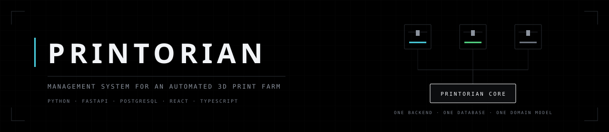
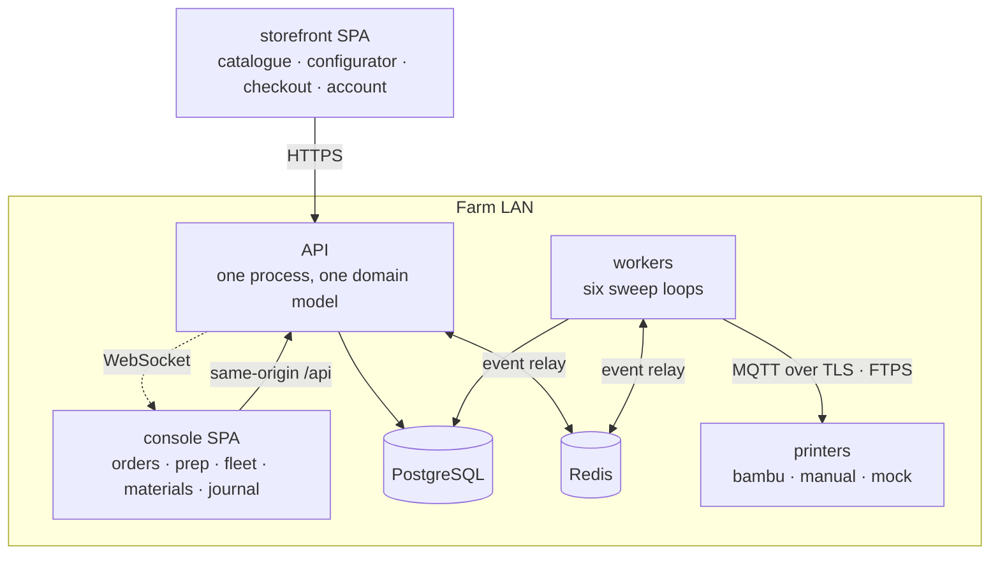
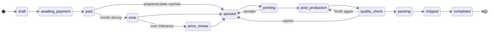

<div align="center">

<picture>
  <source media="(prefers-color-scheme: dark)" srcset="docs/assets/banner.svg">
  <source media="(prefers-color-scheme: light)" srcset="docs/assets/banner-light.svg">
  
</picture>

<br>

[](../../actions/workflows/ci.yml)
[](backend/pyproject.toml)
[](backend/printorian/api)
[](docs/DATABASE-REVIEW.md)
[](frontend)
[](frontend)
<br>
[](docs/ARCHITECTURE.md)
[](docs/adr/README.md)
[](docs/INFRASTRUCTURE.md)

</div>

---

A customer-facing configurator with transparent pricing, automatic printer assignment
and dispatch, and farm-floor operations — for an automated 3D print farm, Bambu Lab
first.

**Stack:** Python / FastAPI / PostgreSQL on the farm LAN · two React SPAs — a storefront
on internet hosting and a farm console on the LAN
([ADR-0016](docs/adr/0016-two-web-apps-no-desktop.md)).

## Run it

```bash
run_web.bat        # database, API, workers, storefront on :5173
```

`run_console.bat` adds the farm console on :5174, reusing anything already up.
`run_design.bat` serves the static design kit on :4180.

> [!TIP]
> First-time setup — virtualenv, npm install, migrations — is in
> [docs/DEVELOPMENT.md](docs/DEVELOPMENT.md). Standing the stack up on a real host for
> the first time is [docs/RUNBOOK-FIRST-BOOT.md](docs/RUNBOOK-FIRST-BOOT.md).

## How it fits together



The API and the workers are **separate containers with an in-process bus each**, so
everything a sweep raises reaches a watching console through the Redis relay
(`core/relay.py`). Without it those events die in the worker and the boards go quiet —
which is why the release gate *proves* the relay rather than trusting it. What crosses
that WebSocket is an invalidation, never state
([ADR-0015](docs/adr/0015-live-events-are-invalidation-not-state.md)): the console is
told what went stale and asks for it, so a dropped frame costs a refetch rather than
leaving two screens quietly disagreeing.

## The four rules

|   | Rule | Held up by |
|---|---|---|
| **1** | **One backend, one database, one domain model.** No mirrored entities, no sync layer. | an `import-linter` contract |
| **2** | **One pricing engine** — a pure deterministic function. Transparent breakdowns and per-option price deltas fall out of it for free. | [ADR-0002](docs/adr/0002-pricing-is-a-pure-function.md) |
| **3** | **Drivers never simulate silently.** A disconnected printer reports `Offline` and raises an alert. It never invents data. | a driver interface with no fallback path |
| **4** | **A feature is done only when a test proves it.** Status docs say *works* / *scaffolded* / *stubbed*. | a CI gate |

Each is enforced structurally rather than by care. See [docs/adr/](docs/adr/README.md)
for why each one is worth that.

> [!IMPORTANT]
> Rule 3 generalises past drivers: **a null reading is "not measured", not `0`.** An
> hour with no telemetry is not an idle hour, an unknown id must 404 rather than answer
> an empty grid, and a denominator must be what was *observed* — never the roster.
> Otherwise the worse the coverage, the healthier the farm looks, and the error is
> silent and flattering.

<details>
<summary><b>An order's life — fourteen states, nine of them visible to the customer</b></summary>

<br>

Two of them exist because reality demanded them: `prep`, where a human slices before
anything can be dispatched ([ADR-0006](docs/adr/0006-human-gated-slicing.md)), and
`price_review`, where the sliced truth exceeded the quote beyond tolerance and the order
is held for a decision rather than silently costing the farm money or silently
overcharging the customer ([ADR-0013](docs/adr/0013-estimate-variance-policy.md)).



`cancelled` is reachable only from `draft` and `awaiting_payment`; `refunded` from
`paid` through `post_production`. Anything outside the table is a bug rather than a
business decision, and is refused loudly rather than half-applied —
`contexts/ordering/policies.py`.

</details>

## Read in this order

Working on this with an AI agent? [CLAUDE.md](CLAUDE.md) carries the rules that hold
everywhere, with the area-specific ones beside the code they govern —
[backend/CLAUDE.md](backend/CLAUDE.md) and [frontend/CLAUDE.md](frontend/CLAUDE.md),
so a session only loads what it needs. [HANDOFF.md](HANDOFF.md) carries the current
state: what just changed, what is deliberately unfinished, and what needs a person
rather than an agent.

**Open work is in [issues](https://github.com/iritur/printorian/issues)**, grouped by
milestone and described in [docs/WORKFLOW.md](docs/WORKFLOW.md). The documents below
say what the system *is*; the tracker says what is *missing*, and only the tracker
says it.

| Document | What it covers |
|---|---|
| [docs/WORKFLOW.md](docs/WORKFLOW.md) | How the issue tracker is used — labels, milestones, and what closes an issue |
| [printorian_scenario.txt](docs/printorian_scenario.txt) | The product scenario — source of truth for requirements |
| [docs/ANALYSIS.md](docs/ANALYSIS.md) | What the scenario requires, decomposed into capabilities with the difficulty named |
| [docs/ARCHITECTURE.md](docs/ARCHITECTURE.md) | Locked decisions, module map, pricing engine, scheduler, drivers, governance |
| [docs/ROADMAP.md](docs/ROADMAP.md) | Phase plan with exit criteria and risks |
| [docs/adr/](docs/adr/README.md) | 21 locked decisions, each with the problem that motivated it |
| [docs/GLOSSARY.md](docs/GLOSSARY.md) | One agreed name per concept, RU / EN |
| [docs/DEVELOPMENT.md](docs/DEVELOPMENT.md) | Setup, daily commands, the CI gates |
| [docs/DATABASE-REVIEW.md](docs/DATABASE-REVIEW.md) | Schema by context, indexing, partitioning, and the accepted trade-offs |
| [docs/DESIGN-KIT.md](docs/DESIGN-KIT.md) | Which of the twenty-one kit screens exist, and what the unbuilt ones would need |
| [docs/INFRASTRUCTURE.md](docs/INFRASTRUCTURE.md) | Containers, release gate, deployment stages |
| [docs/RUNBOOK-FIRST-BOOT.md](docs/RUNBOOK-FIRST-BOOT.md) | Standing the stack up on a real host, and the pre-flight that fails early |
| [docs/RUNBOOK-BACKUP-RESTORE.md](docs/RUNBOOK-BACKUP-RESTORE.md) | WAL archiving, base backups, the restore drill |
| [docs/RUNBOOK-PAYMENTS.md](docs/RUNBOOK-PAYMENTS.md) | YooKassa and T-Pay: method selection, demo-store vs live-store testing, test cards |
| [docs/RUNBOOK-FIRST-PRINT.md](docs/RUNBOOK-FIRST-PRINT.md) | Proving the driver against a real printer — the largest unproven assumption in the system |
| [docs/BAMBU-LAN-PROTOCOL.md](docs/BAMBU-LAN-PROTOCOL.md) | Spike findings from a real printer — the spec the Phase 3 driver is built from |

## Layout

```
backend/
  printorian/core/        config, Money, units, ids, clock, errors, events, db
                          cpu (blocking work, off the loop) · relay (events across
                          processes) · ratelimit · heartbeat · secrets · storage
  printorian/contexts/    account · catalog · fleet · identity · inventory · journal
                          ordering · packaging · payments · postproduction · pricing
                          production · scheduling · settings
  printorian/drivers/     printer adapters — bambu, manual, mock
  printorian/workers/     scheduler · telemetry · sla · postproduction · packaging ·
                          maintenance — each beats at the end of every pass
  printorian/api/         thin HTTP layer; authorization enforced here
  tools/                  governance gates, OpenAPI export, Bambu spike
frontend/
  apps/web/               storefront — catalogue, configurator, checkout, journal
  apps/console/           farm console — orders, prep, library, journal, fleet,
                          materials, users, settings
  packages/ui/            Harvester design system, RU/EN catalogues, DataTable
  packages/api-client/    generated from OpenAPI — never hand-edited
  packages/events/        the WebSocket event stream both apps subscribe to
deploy/                   production compose and the Caddyfile the release gate runs
design/                   the static design kit the UI is built against
```

## Status

Built and working end to end: pricing engine and quote/preview API · STL analysis and
the model catalogue with staff curation · inventory with AMS-slot locations · the
storefront configurator, checkout with delivery and payment, order tracking with the
nine-stage pipeline and queue position, and the customer account — profile, loyalty
ladder, addresses, uploads, receipts and sessions · the farm console · the journal with
an RSS feed · fleet, production, scheduling and the virtual farm harness · the settings
screen, with write-only encrypted secrets and an audited «было · стало» per save ·
one-image containers with a release gate (INFRASTRUCTURE Stage 1).

> [!WARNING]
> **Two things are not proven, and both need hardware or an account this repository
> cannot supply.**
>
> - The Bambu LAN spike ran against a real X2D and its findings are the specification
>   Phase 3 builds from — telemetry and control proven, the FTPS *write* still pending
>   storage in the test machine
>   ([docs/BAMBU-LAN-PROTOCOL.md](docs/BAMBU-LAN-PROTOCOL.md)).
> - Payments run against the `mock` and `manual` providers. The YooKassa adapter exists
>   but has never been exercised against the real gateway in test mode, which is what
>   [Phase 2's exit criterion](docs/ROADMAP.md) asks for.

> [!NOTE]
> [HANDOFF.md](HANDOFF.md) is the live status — test counts, what landed last, and what
> is next, each verified against the code rather than read off a plan. Prefer it to any
> summary here: this section is the shape, that one is the state.

<details>
<summary><b>What CI actually proves</b></summary>

<br>

Three jobs, and the third is the one that matters.

**backend** — six governance gates before a single test runs, so a structural
regression fails fast and unambiguously: `ruff check`, `ruff format --check`,
`mypy --strict`, `lint-imports`, context isolation, file length. Then tests on a real
PostgreSQL ([ADR-0021](docs/adr/0021-tests-run-on-postgresql.md)), migrations applied
from scratch, and `alembic check` — the models and the migrations cannot drift.

**frontend** — the API client is generated from the schema the backend job exported,
never committed ([ADR-0005](docs/adr/0005-generated-api-client.md)). That is what makes
a breaking backend change fail the build at the commit that caused it, rather than in
somebody's editor a week later.

**image** — the two jobs above test the *source tree*. Nothing there proves the thing
that actually ships works: a missing system library, a wrong entrypoint, a migration
that only runs with a dev dependency present, a base image that moved underneath us.
So this job builds the images and then *runs* them, against the same
`deploy/compose.prod.yml` the farm uses — migrations forwards, backwards and forwards
again; readiness reporting its dependencies; the console's same-origin proxy; every
worker loop proven to be *sweeping* rather than merely running; and a live event raised
in one container proven to reach the other. Only then does it scan, SBOM, push and sign
(cosign keyless, via the job's OIDC identity — no key to store, rotate or lose).

</details>

<details>
<summary><b>Load-bearing behaviour worth knowing about</b></summary>

<br>

- **Blocking work never runs on the event loop.** The API is one process, so a second
  spent parsing a mesh is a second in which it serves nothing — not the storefront, not
  the console, not the health check. `core/cpu.py` runs that work in a bounded thread
  pool, and carries the measurements that make it a bug rather than a preference.
- **Live events cross the process boundary.** See the topology above: without the Redis
  relay, everything a sweep raises dies in the worker and the boards are live only for
  what somebody clicked.
- **The endpoints that cost something have ceilings.** `POST /pricing/quote` takes an
  optional actor and parses a mesh, so it is rate-limited; sign-in has a lockout;
  request bodies are refused by size before anything buffers them.
- **A worker that is running but not working is visible.** Each loop beats at the end of
  every pass, and `python -m printorian.workers --check` is the container's healthcheck
  — a process check that cannot tell working from wedged is worse than none.
- **Money is walled off from production data.** `VIEW_FINANCIALS` is kept separate from
  every production permission, so a response carrying seconds cannot quietly start
  carrying rubles or kilowatt-hours.

</details>

---

<div align="center">

**Next:** [docs/ROADMAP.md](docs/ROADMAP.md) for the phase plan ·
[docs/INFRASTRUCTURE.md](docs/INFRASTRUCTURE.md) for deployment Stage 2 onwards

</div>
